# homework-borg

Описание домашнего задания
---
Настроить стенд Vagrant с двумя виртуальными машинами: backup_server и client.

Настроить удаленный бэкап каталога /etc c сервера client при помощи borgbackup. Резервные копии должны соответствовать следующим критериям:

директория для резервных копий /var/backup. Это должна быть отдельная точка монтирования.

репозиторий для резервных копий должен быть зашифрован ключом или паролем - на усмотрение студента;

имя бэкапа должно содержать информацию о времени снятия бекапа;

глубина бекапа должна быть год, хранить можно по последней копии на конец месяца, кроме последних трех. Последние три месяца должны содержать копии на каждый день. Т.е. должна быть правильно настроена политика удаления старых бэкапов;

резервная копия снимается каждые 5 минут. Такой частый запуск в целях демонстрации;

написан скрипт для снятия резервных копий. Скрипт запускается из соответствующей Cron джобы, либо systemd timer-а - на усмотрение студента;
настроено логирование процесса бекапа. Для упрощения можно весь вывод перенаправлять в logger с соответствующим тегом. Если настроите не в syslog, то обязательна ротация логов.


---
ОС для настройки: ubuntu 22_04

Vagrant версии 2.4.1

VirtualBox версии 7.0.18

Тестовый стенд:
backup 192.168.56.101 Ubuntu 22.04
client 192.168.56.103 Ubuntu 22.04

---
- Этап 1: Настройка сервера

**Монтируем новый диск на сервере**

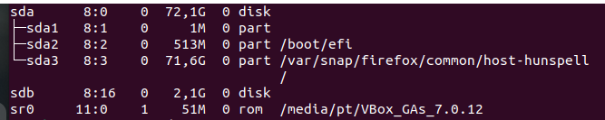

```bash
sudo fdisk /dev/sdb
``` 

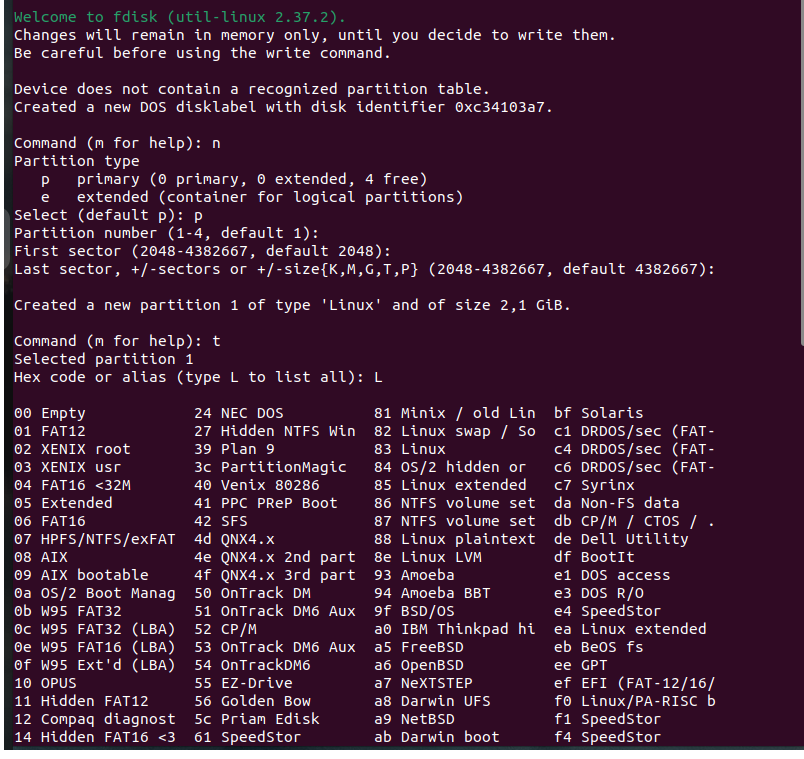
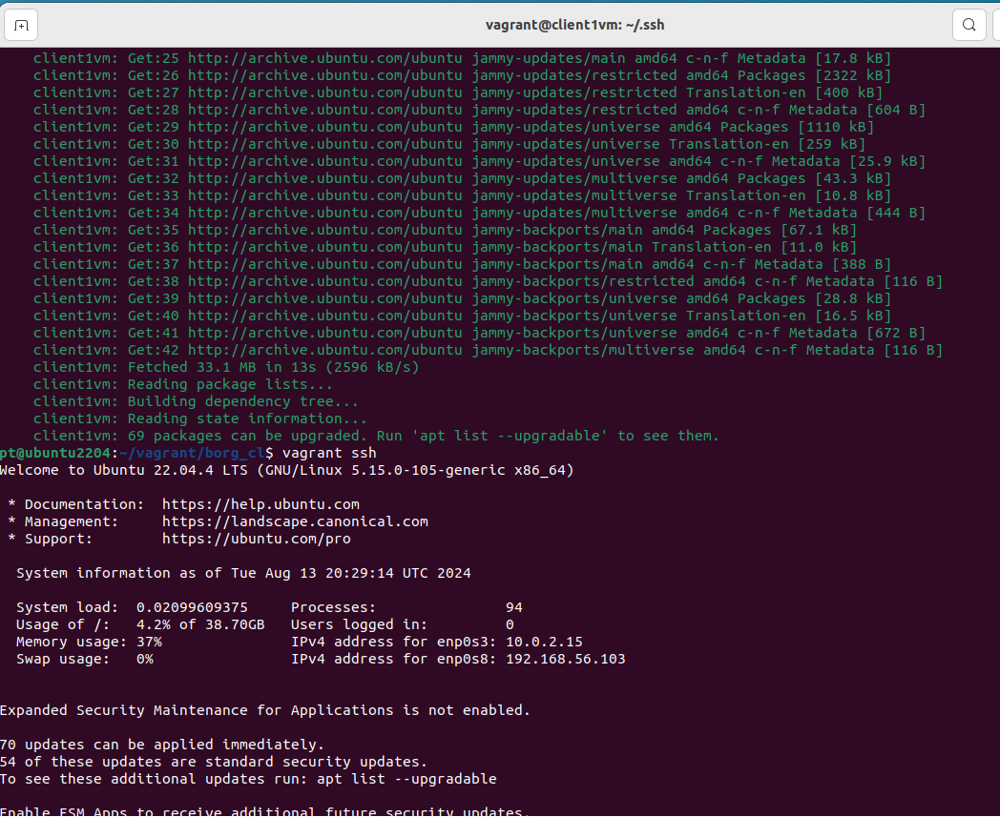

**Создаем пользователя borg**

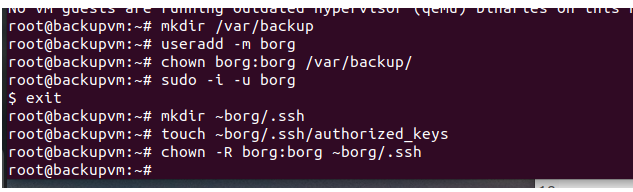

---
- Этап 2: Поднимаем ВМ с клиентом и устанавливаем borg (на сервере, кстати, его тоже требуется установить, процесс аналогичен)

**Установка borg**


```bash
apt install borgbackup
```

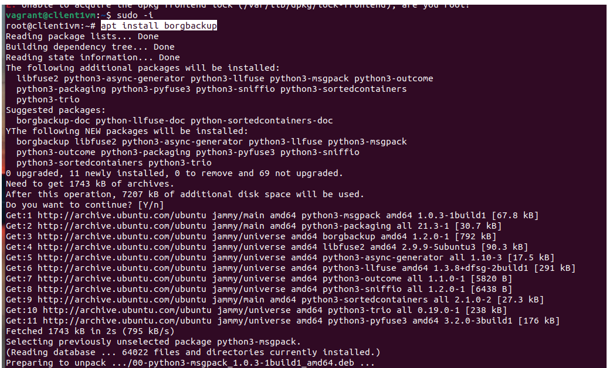

**Создание ключа** для ssh подключения к репо. Проверка хэша

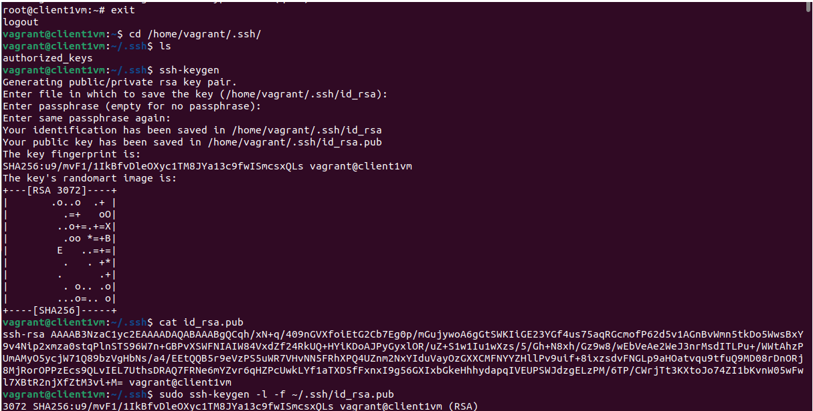


**Добавление и проверка хэша на сервере** Это была боль номер 1. Чтобы тут не ухоидть в дебри, вынесу описание этой чехарды в самый канец, как неудачные дубли в конце фильмов с Джеки Чаном 

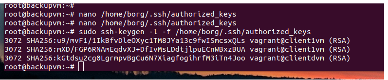


**Инициализируем репозиторий borg на backup сервере с client сервера**

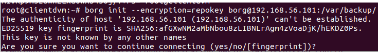

___
- Этап 3: Написание скрипта 

**Создаем новый скрипт**

```bash
#!/bin/bash

# Удаление старых бэкапов
borg prune --list --keep-daily=31 --keep-weekly=4 --keep-monthly=12 borg@192.168.56.101:/var/backup/ 2>&1 | logger "borg_prune_" &&  logger "borg_prune" 

# Резервное копирование
borg create -C zstd borg@192.168.56.101:/var/backup/::"vag-{now:%Y-%m-%d_%H:%M:%S}" /etc 2>&1 | logger "borg_create_" &&  logger "borg_create"

# команды после && добавляют логирование в журналы
```

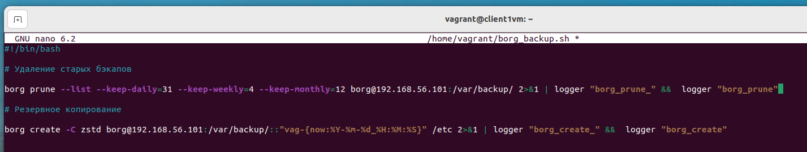


**Даем скрипту права на исполнение**

```bash
chmod +x borg_backup.sh
```

**Объявляем пароль для репо, чтобы не вводить**
**ВАЖНО** - этого будет недостаточно. Читай до конца

```bash
export BORG_PASSPHRASE="borg"  
```

**Посмотреть логи**

```bash
sudo tail -10 /var/log/syslog
```


**Посмотреть конкретный бэкап в репо**

```bash
borg list borg@192.168.56.101:/var/backup/::etc-2024-08-13_20:41:08
```
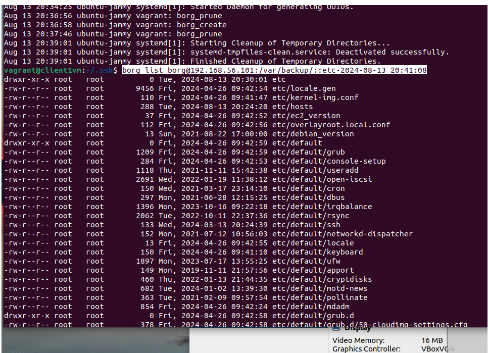


___
- Этап 4: Cron. А это была боль номер 2. 

 **Настраиваем задание** ис под пользователя vagrant, НЕ root. В общем, ис под того, от которого будет запускаться потом. Рут не имеет доступа до репы 

```bash
crontab -e
```
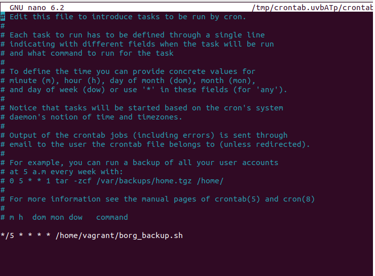


Вот так можно увидеть, от какого пользователя запускается cron

```bash
sudo tail -20 /var/log/syslog
#Это надо, потому что доступ по ssh не у всех пользователей
```

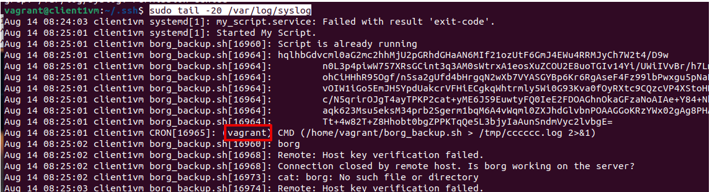

Добавим вот такую строку в скрипт для логирования ошибок

```bash
2>&1 | logger -t "borg_2"
```

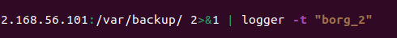

В итоге получаем

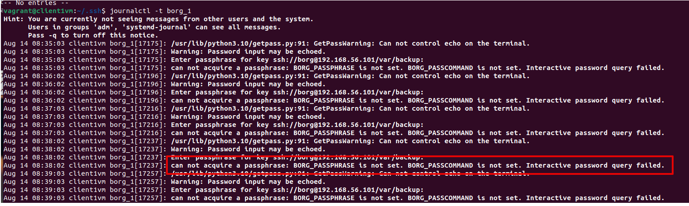

Видно, что он не может ввести пароль. Но пароль запрашивается, значит доступ по ssh получен нормально (уже блин успех)

А вот тут не понятно, какой ключ не подходит...

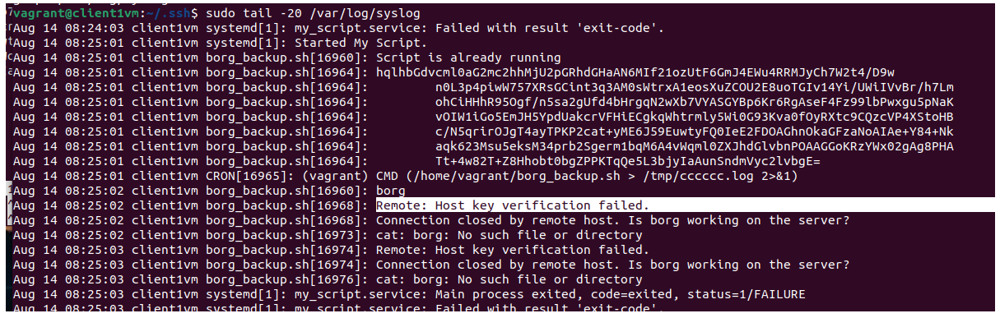


И вот тут, спустя невероятно много времени я прихожу к выводу, что коль у нас есть доступ до репы, но не получается в нее пробиться, я понимаю, что cron не может подтянуть переменную.

**ВАЖНО**. У меня были такие мысли, но во время отладки я несколько раз вызывал эту переменную просто в коде, через echo, cat из файла - ВСЁ работало! Поэтому мыслей, что в этом дело особо не возникало. 
Судя по всему, команды в скрипте выполняются из под пользователя, и переменные доступны, но если cron куда-то идет, и там требуется терминально ввести пароль, этот пароль уже не может подтянуться из локальных переменных пользователя. ХЗ почему, но вот так
2 дня! 2 дня я с этим разбирался, интернет не помог. 

Переменную я уже объявлял, но еще раз если сделать это

```bash
echo 'export BORG_PASSPHRASE=borg' >> ~/.bashrc
```

Тут мы видим, что она и в прошлый раз применилась, и в этот. Кавычки не знаю, почему есть в первом варианте, но это не влияет. без кавычек все равно не работет 

```bash
nano ~/.bashrc
Или
nano /home/vagrant/.bashrc
```

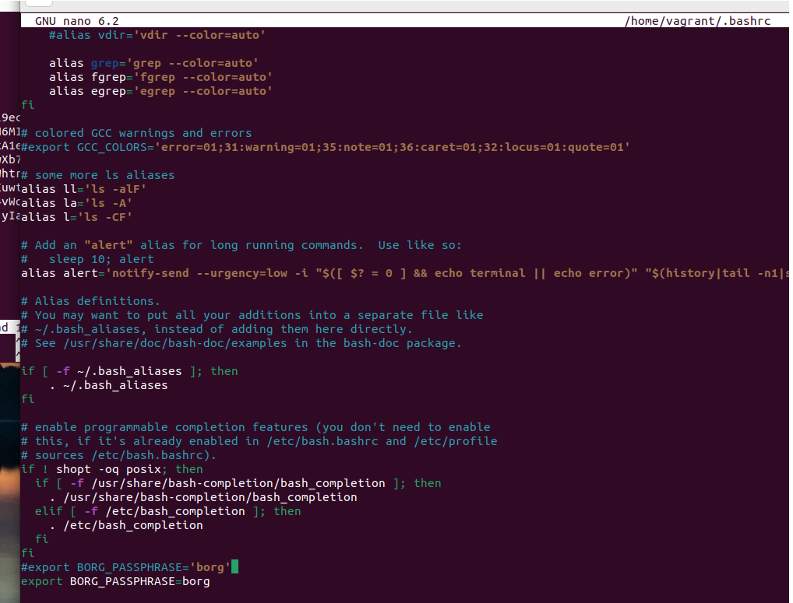

И как бы мы получаем значение, если запросим переменную

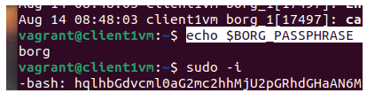

Но **проблему решило** добавление переменной в глобальную переменную (ис под рута)
echo 'BORG_PASSPHRASE=borg' | sudo tee -a /etc/environment

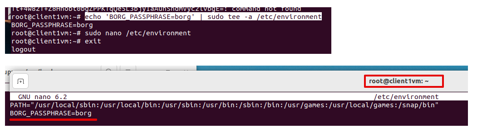

Готово. Скрипт работает автоматически. Сначала для отладки делал минуту, потому сменил на 5 как по заданию, результат видно

```bash
sudo tail -20 /var/log/syslog
```

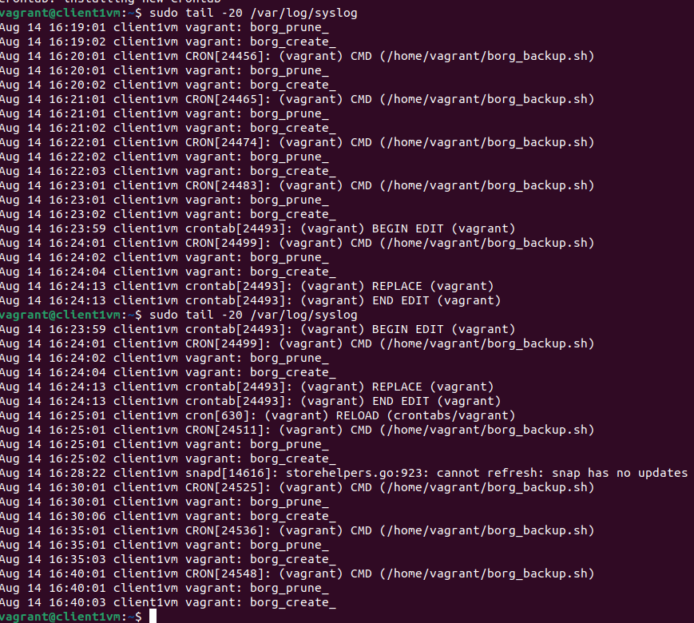

```bash
journalctl | grep borg
```

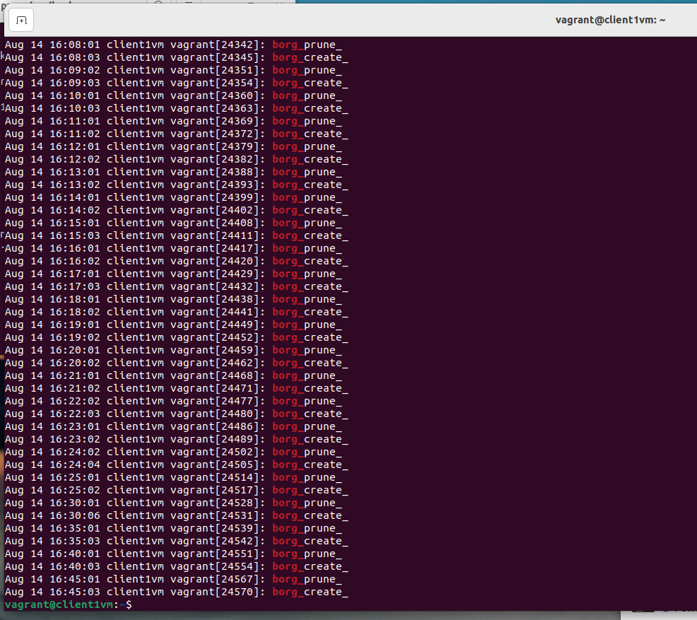

___
Неудачные дубли с Джеки Чаном

Доступ по SSH.... 

Есть 2 машины

Сервер, к которому подклчаемся
Клиент, который подключается 

На сервере надо указать открытый ключ в файле конкретного пользователя, которым (а не с которого на клиенте) мы будем подключаться

Например, на клиенте мы под пользователем vasya, но подключаемся пользователем user1
Значит на сервере должен быть user1, у него должна быть папка /home/user1/.ssh/authorized_keys
В этом файле должен быть открытый ключ

Проверить хэш сумму открытого ключа можно вот так. На сервере и на клиенте должны совпадать 

Сервер
```bash
sudo ssh-keygen -l -f ~/.ssh/authorized_keys
sudo ssh-keygen -l -f /home/borg/.ssh/authorized_keys
```

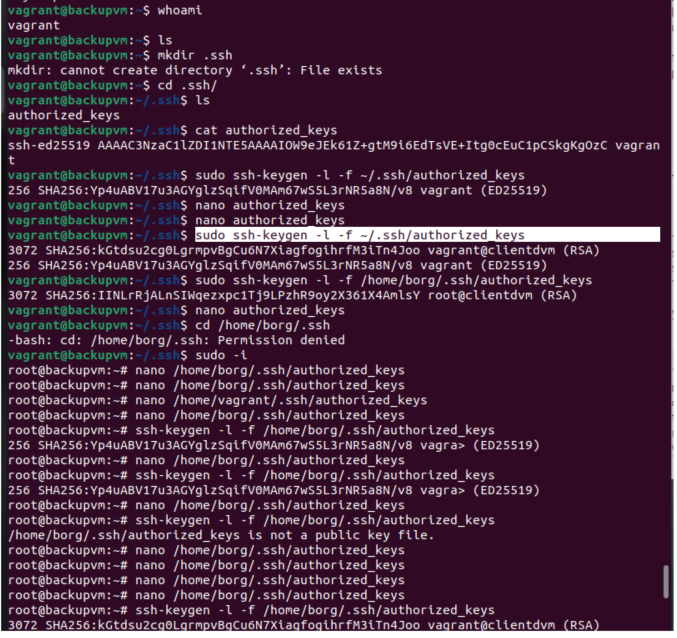

Клиент
sudo ssh-keygen -l -f ~/.ssh/id_rsa.pub
sudo ssh-keygen -l -f ~/.ssh/id_rsa

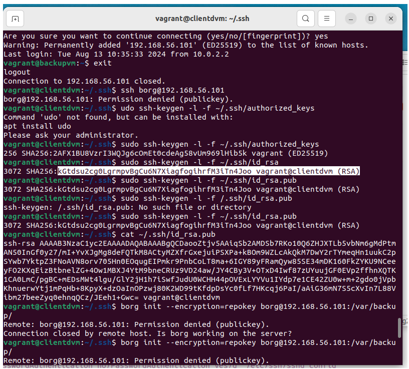

И самое интересное, на чем я потерял еще пару вечеров
ПОЛЬЗОТЕЛЬ ДОЛЖНЕ БЫТЬ АКТИВНЫЙ,
ЕСЛИ СОЗДАВАТЬ ПОЛЬЗОВАТЕЛЯ БЕЗ ПАРОЛЯ, ПО ДЕФОЛТУ ОН ЗАБЛОЧЕН !!!!!!!!!!!


Сначала пользователь был заблокирован

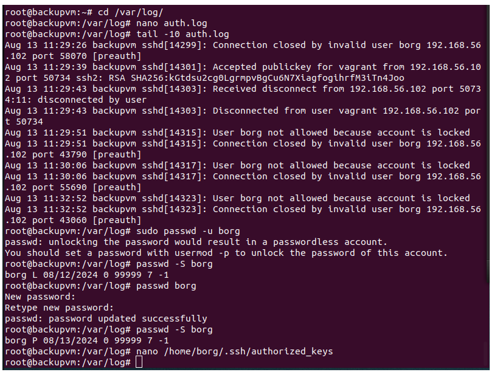

Потом разблокировал его, но ключ не подходил

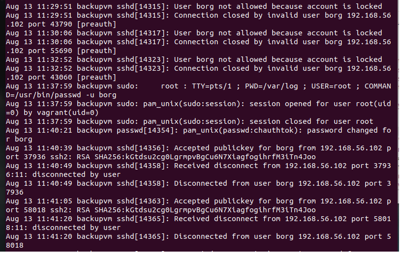

Сначала пользователь был заблокирован

**Полезное**
На сервере можно проверить порт из конфига (при данной настройке все работатет)

```bash
grep Port /etc/ssh/sshd_config
```
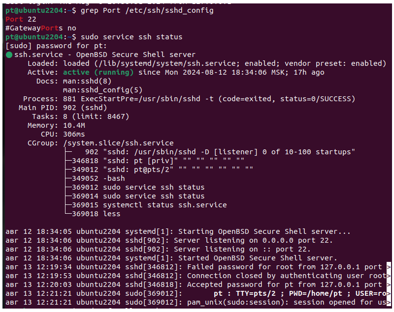

ВОТ так с клиента проверить можно открытость и доступность порта

```bash
nmap 192.168.56.101 -PN -p ssh | egrep 'open|closed|filtered'
```

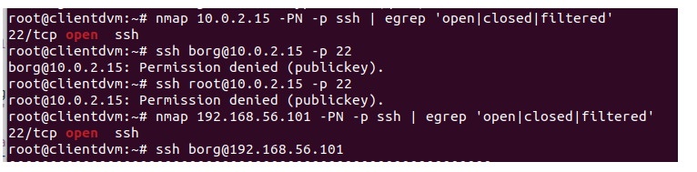


На клиенте может возникнуть вот такая проблема

```bash
WARNING: REMOTE HOST IDENTIFICATION HAS CHANGED! 
T IS POSSIBLE THAT SOMEONE IS DOING SOMETHING NASTY!

Someone could be eavesdropping on you right now (man-in-the-middle attack)!
It is also possible that a host key has just been changed.
The fingerprint for the ED25519 key sent by the remote host is
```

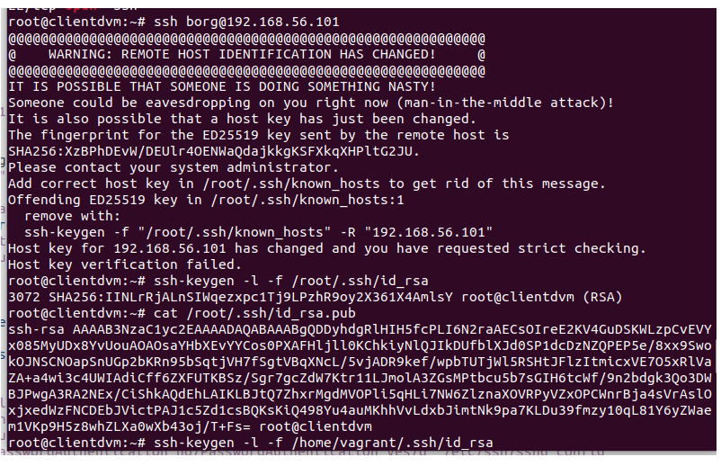

**Это значит**, что хост уже известен, но как бы под других хэшем, это проблема. 
Обнулить его можно 

```bash
ssh-keygen -R 192.168.56.101 (это адрес сервера)
```

**Создание открытого и закрытого ключа**

```bash
ssh-keygen
#Копировать из открытого ключа в файл с авторизованными ключами на сервере надо все из
cat ~/.ssh/id_rsa.pub
```

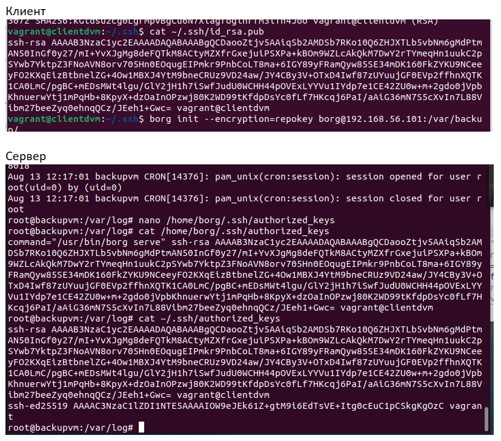


___
В общем, резюмируя
1. Смотреть хэши ключей, что они совпадают. Особенно, работая с виртуалками
2. Следить, от какого пользователя ключ создался и от какого идет подключение.
3. Пользователь, которым подключаемся, должен быть активным!!!
4. cron не всегда умеет в локальные переменные, поэтому надо объявлять их глобально


